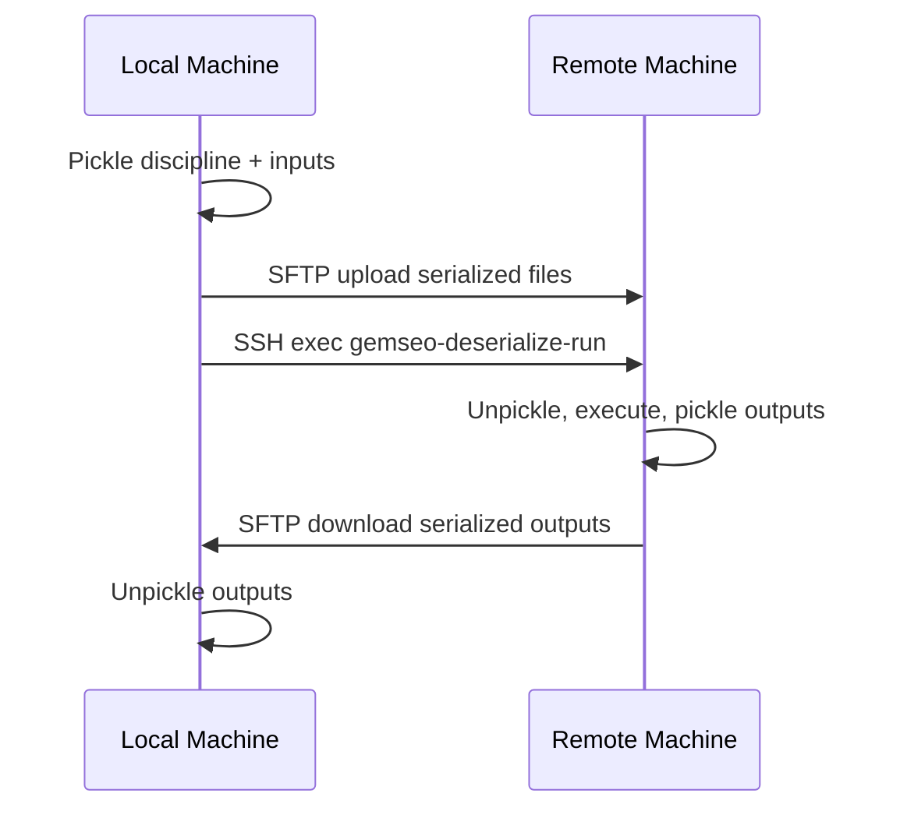

<!--
Copyright 2021 IRT Saint Exupéry, https://www.irt-saintexupery.com

This work is licensed under the Creative Commons Attribution-ShareAlike 4.0
International License. To view a copy of this license, visit
http://creativecommons.org/licenses/by-sa/4.0/ or send a letter to Creative
Commons, PO Box 1866, Mountain View, CA 94042, USA.
-->

# gemseo-ssh

[](https://www.gnu.org/licenses/lgpl-3.0.en.html)
[](https://pypi.org/project/gemseo-ssh/)
[](https://pypi.org/project/gemseo-ssh/)
[](https://app.codecov.io/gl/gemseo:dev/gemseo-ssh)

## Overview

**gemseo-ssh** is a GEMSEO plugin that wraps any GEMSEO `Discipline` for remote
execution over SSH/SFTP using [paramiko](https://www.paramiko.org). It allows you
to distribute MDO computations across multiple machines and operating systems
(Linux, Windows, macOS), and can be combined with GEMSEO's job scheduler interface
to submit disciplines to remote HPC clusters.

## How it works

The plugin serializes a discipline and its inputs, transfers them to a remote
machine via SFTP, executes the discipline remotely via SSH, then downloads and
deserializes the outputs.



## Installation

Install the latest version with `pip install gemseo-ssh`.

See [pip](https://pip.pypa.io/en/stable/getting-started/) for more information.

## Requirements

**Local machine:**

- `pip install gemseo-ssh`

**Remote machine:**

- The **same major version** of GEMSEO as on the local machine (gemseo-ssh itself is
  **not** needed on the remote).
- The Python environment that contains GEMSEO must be activated.
  This can be done using the `pre_commands` keyword argument in the `wrap_discipline_with_ssh` helper function
  or in the `SSHDisciplineWrapper` constructor,
  or by configuring the remote machine to activate this environment by default.
- All Python modules imported by the discipline must be available.

**Network:**

- SSH access from the local machine to the remote machine.

## Quick examples

### Minimal example: AnalyticDiscipline with key-based auth

```python
from gemseo import create_discipline
from gemseo_ssh import wrap_discipline_with_ssh
from numpy import array

# Create a local discipline
analytic_disc = create_discipline(
    "AnalyticDiscipline", expressions={"y": "2*x+1"}
)

# Wrap it for remote execution
remote_disc = wrap_discipline_with_ssh(
    discipline=analytic_disc,
    hostname="remote_hostname",
    local_workdir_path=".",
    remote_workdir_path="~/test_ssh",
    key_filename="/home/user/.ssh/id_rsa",
)

# Execute remotely - same interface as any GEMSEO discipline
data = remote_disc.execute({"x": array([1.0])})
print(data["y"])  # array([3.0])
```

### MDA with password auth

```python
from gemseo import create_discipline
from gemseo import create_mda
from gemseo_ssh import wrap_discipline_with_ssh

# Create a multidisciplinary analysis
disciplines = create_discipline([
    "SobieskiPropulsion",
    "SobieskiAerodynamics",
    "SobieskiMission",
    "SobieskiStructure",
])
mda = create_mda("MDAChain", disciplines)

# Wrap the entire MDA for remote execution
remote_mda = wrap_discipline_with_ssh(
    discipline=mda,
    hostname="remote_hostname",
    local_workdir_path=".",
    remote_workdir_path="~/test_ssh",
    username="my_username",
    password="my_password",
)

# Execute - uses default_inputs from the original disciplines
couplings = remote_mda.execute()
```

For more examples and detailed usage, see the
[user guide](https://gemseo.readthedocs.io/projects/gemseo-ssh/latest/user_guide/).

## Bugs and questions

Please use the [gitlab issue tracker](https://gitlab.com/gemseo/dev/gemseo-ssh/-/issues)
to submit bugs or questions.

## Contributing

See the [contributing section of GEMSEO](https://gemseo.readthedocs.io/en/stable/software/developing.html#dev).

## Contributors

- Jean-Christophe Giret
- François Gallard
- Nicolas Roussoully
- Antoine Dechaume
