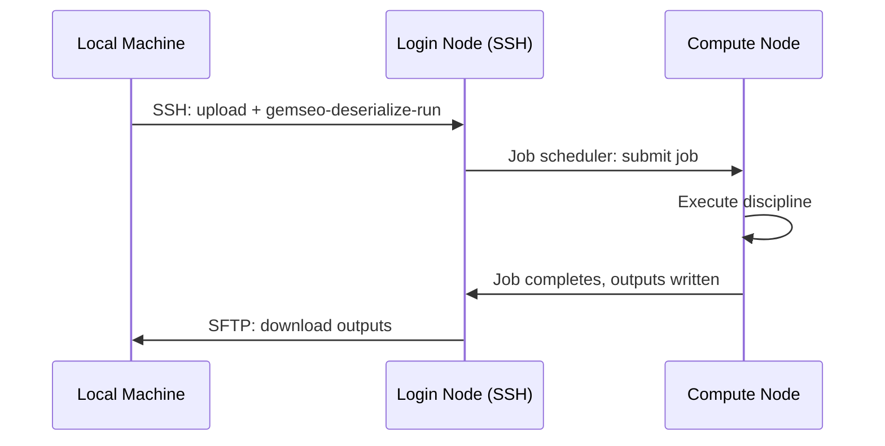

<!--
Copyright 2021 IRT Saint Exupéry, https://www.irt-saintexupery.com

This work is licensed under the Creative Commons Attribution-ShareAlike 4.0
International License. To view a copy of this license, visit
http://creativecommons.org/licenses/by-sa/4.0/ or send a letter to Creative
Commons, PO Box 1866, Mountain View, CA 94042, USA.
-->
# Advanced Usage

## Linearization over SSH

The SSH wrapper fully supports discipline linearization (Jacobian computation).
When `linearize()` is called, the remote command receives `--linearize` and
optionally `--execute-at-linearize` flags.

```python
from gemseo import create_discipline
from gemseo_ssh import wrap_discipline_with_ssh
from numpy import array

disc = create_discipline("AnalyticDiscipline", expressions={"y": "x1 + 2*x2"})

wrapper = wrap_discipline_with_ssh(
    discipline=disc,
    hostname="remote_host",
    local_workdir_path="/tmp/workdir",
    username="jdoe",
    key_filename="/home/jdoe/.ssh/id_rsa",
)

# Compute Jacobian remotely (also executes the discipline by default)
wrapper.add_differentiated_inputs(["x1", "x2"])
wrapper.add_differentiated_outputs(["y"])
jac = wrapper.linearize({"x1": array([1.0]), "x2": array([2.0])})

print(jac["y"]["x1"])  # array([[1.]])
print(jac["y"]["x2"])  # array([[2.]])
```

To compute the Jacobian **without** re-executing the discipline (if it was already
executed with the same inputs):

```python
jac = wrapper.linearize(input_data, execute=False)
```

## Job scheduler integration

You can combine gemseo-ssh with GEMSEO's job scheduler interface to submit
disciplines to an HPC cluster. Wrap the `JobSchedulerDisciplineWrapper` inside the
SSH wrapper: the entire job scheduler wrapper is pickled and sent to the login node,
which then submits to compute nodes.



```python
from gemseo import create_discipline
from gemseo import wrap_discipline_in_job_scheduler
from gemseo_ssh import wrap_discipline_with_ssh
from numpy import array

disc = create_discipline("AnalyticDiscipline", expressions={"y": "2*x+1"})

# First, wrap in job scheduler
scheduled_disc = wrap_discipline_in_job_scheduler(
    discipline=disc,
    scheduler_name="SLURM",
    workdir_path="/scratch/user/jobs",
)

# Then, wrap the scheduler discipline for SSH execution
remote_disc = wrap_discipline_with_ssh(
    discipline=scheduled_disc,
    hostname="hpc-login.example.com",
    local_workdir_path="/tmp/workdir",
    remote_workdir_path="~/ssh_workdir",
    pre_commands=("module load python/3.12", ". ~/venv/bin/activate"),
    username="jdoe",
    key_filename="/home/jdoe/.ssh/id_rsa",
)

result = remote_disc.execute({"x": array([1.0])})
```

## Error handling and debugging

### Remote exceptions

When the discipline raises an exception on the remote machine, the exception and
its traceback are pickled into the output file and **re-raised locally**. You see
the full remote traceback in your local error output.

### SSH connection errors

Common SSH errors and their causes:

- `paramiko.AuthenticationException` -- Wrong credentials, key not accepted
- `socket.gaierror` -- Hostname cannot be resolved
- `socket.timeout` / `ConnectionRefusedError` -- Host unreachable or SSH port
  blocked
- `RuntimeError("Cannot get the ssh transport")` -- Transport layer failed after
  connection

### Missing files

- `FileNotFoundError("No such file on remote host: ...")` -- A file expected on
  the remote does not exist (e.g., output pickle not created)
- `FileNotFoundError("No such file on local host: ...")` -- An input file to
  upload does not exist locally
- `FileNotFoundError("Serialized discipline outputs file does not exist ...")` --
  The remote execution did not produce the expected output file

### Non-zero exit codes

!!! warning "Non-zero exit codes are logged, not raised"

    If the remote command exits with a non-zero code, the error is **logged** (with
    stdout/stderr) but **not raised as an exception**. The subsequent attempt to
    download the output pickle may then fail with a `FileNotFoundError`. Enable
    debug logging (see below) to inspect the remote command's stdout/stderr and
    diagnose the failure.

!!! tip "Debugging"

    1. **Enable debug logging** to see SSH commands, file transfers, and timing:

        ```python
        import logging
        logging.getLogger("gemseo_ssh").setLevel(logging.DEBUG)
        ```

    2. **Inspect local UUID directories** in `local_workdir_path/` -- they contain
       the serialized discipline, inputs, and (if successful) outputs.

    3. **Inspect remote UUID directories** via SSH -- check if files were uploaded
       and if `output_data.pckl` was created.

    4. **Test pickling locally** before remote execution:

        ```python
        import pickle
        pickle.dumps(discipline)  # Should not raise
        ```

    5. **Test the remote command manually** via SSH:

        ```bash
        ssh user@host "cd /path/to/uuid_dir && gemseo-deserialize-run \
            discipline.pckl input_data.pckl output_data.pckl"
        ```

## Cross-platform considerations

- All remote paths are converted to **POSIX format** (forward slashes) via
  `.as_posix()` before being sent over SSH/SFTP.
- The `SFTPClient.mkdir()` and `.chdir()` methods handle path conversion
  automatically.
- Use forward slashes or `~` for `remote_workdir_path`, even when the local
  machine is Windows.

## SSH connection details

- **Keep-alive interval:** 600 seconds (constant `SSH_KEEP_ALIVE_INTERVAL`). The
  SSH transport sends keep-alive packets to prevent the connection from being
  dropped by firewalls or NAT devices.
- **Host key policy:** `AutoAddPolicy` -- automatically accepts the host key on
  first connection. The client also loads `~/.ssh/known_hosts`.

!!! warning "Security: automatic host key acceptance"

    `AutoAddPolicy` automatically accepts unknown host keys on first connection
    (Trust On First Use / TOFU model). This is convenient but vulnerable to
    man-in-the-middle attacks if the first connection is compromised. In sensitive
    environments, pre-populate `~/.ssh/known_hosts` with verified host keys
    (e.g., via `ssh-keyscan`) before using gemseo-ssh.
- **Connection lifecycle:** A new SSH connection is opened and closed for **each
  execution** call. There is no connection pooling.

## Namespace support

The SSH wrapper supports GEMSEO namespaces on grammars. If the wrapped discipline
uses namespaces for its inputs or outputs, these are preserved by the wrapper.

You can add namespaces to the wrapper's grammars after wrapping:

```python
from gemseo import create_discipline
from gemseo_ssh import wrap_discipline_with_ssh

disc = create_discipline("SobieskiPropulsion")

wrapper = wrap_discipline_with_ssh(
    discipline=disc,
    hostname="remote_host",
    local_workdir_path="/tmp/workdir",
    username="jdoe",
    key_filename="/home/jdoe/.ssh/id_rsa",
)

# Add namespaces to the wrapper's grammars
wrapper.input_grammar.add_namespace("y_14", "propulsion")
wrapper.output_grammar.add_namespace("y_4", "propulsion")

# Execute -- namespaced names are used in the result
data = wrapper.execute()
assert "propulsion:y_4" in data
```

## Known limitations

- **No connection pooling** -- a new SSH connection is established for each
  `execute()` or `linearize()` call.
- **No automatic cleanup** -- neither local nor remote UUID directories are removed
  after execution.
- **Synchronous execution** -- the remote command is executed synchronously. The SSH
  connection is kept open until the command completes, and network failure may prevent
  the proposer execution of the distant discipline. Retry mechanism can be enforced
  on top of the discipline, but would require the complete restart of the execution.
- **Output files go to root workdir** -- downloaded output files are saved to
  `local_workdir_path/`, not the per-execution UUID subdirectory (see
  [file transfers pitfalls](file_transfers.md#pitfalls-and-warnings)).
- **No built-in SSH tunneling or jump host support** -- use `~/.ssh/config` to
  configure ProxyJump or ProxyCommand for bastion hosts.
- **Same GEMSEO major version match required** -- the local and remote machines must
  have the same GEMSEO major version to ensure pickle compatibility.
