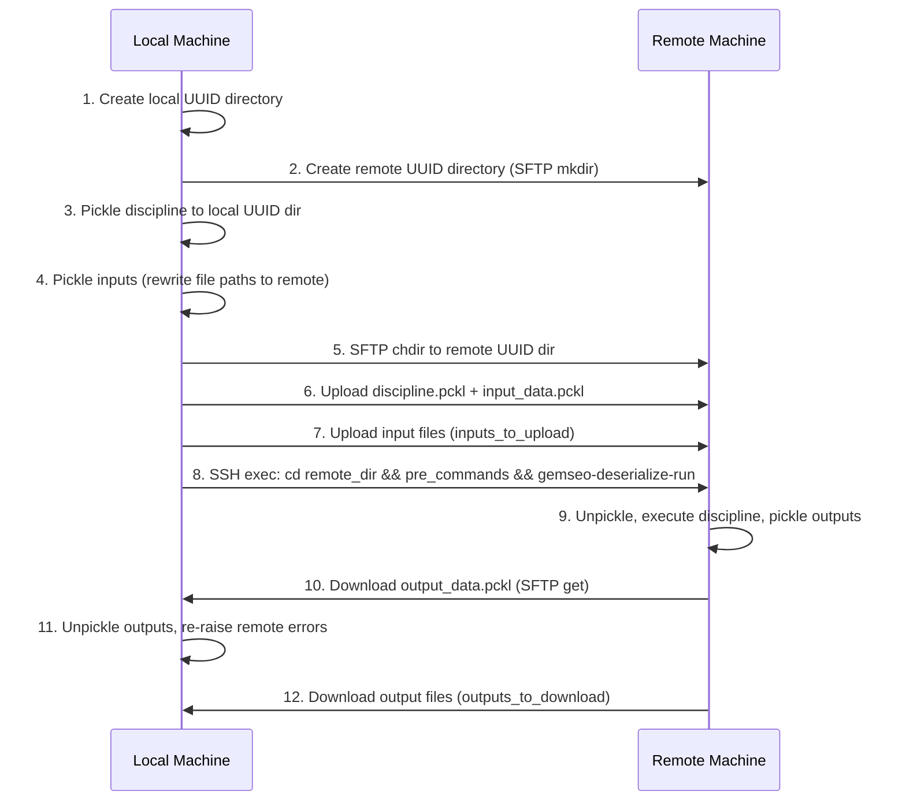
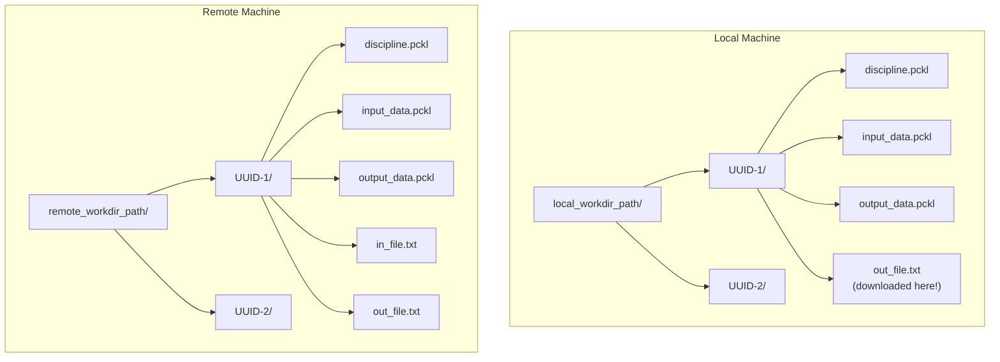

<!--
Copyright 2021 IRT Saint Exupéry, https://www.irt-saintexupery.com

This work is licensed under the Creative Commons Attribution-ShareAlike 4.0
International License. To view a copy of this license, visit
http://creativecommons.org/licenses/by-sa/4.0/ or send a letter to Creative
Commons, PO Box 1866, Mountain View, CA 94042, USA.
-->
# Working with File-Based Disciplines

## When do you need file transfers?

By default, all discipline inputs and outputs are serialized via pickle and
transferred as binary data. No special configuration is needed for numerical
arrays, strings, or other picklable Python objects.

**File transfers** are needed when a discipline's inputs or outputs are **file
paths** referencing physical files on disk. For example, a discipline that reads a
configuration file and writes a results file. In this case, the actual files must
be uploaded to the remote machine before execution and/or downloaded afterward.

## Complete example

Consider a discipline that reads an integer from an input file, increments it, and
writes the result to an output file:

### Discipline definition

```python
from pathlib import Path
from gemseo.core.discipline.discipline import Discipline


class DiscWithFiles(Discipline):
    """A discipline that reads an input file and writes an output file."""

    default_grammar_type = Discipline.GrammarType.SIMPLE

    def __init__(self):
        super().__init__()
        self.input_grammar.update_from_types({"in_file": str})
        self.output_grammar.update_from_types({"out_file": str, "out_val": int})

    def _run(self, input_data):
        in_file_path = Path(input_data["in_file"])
        out_val = int(in_file_path.read_text()) + 1
        out_path = in_file_path.parent / "out_file.txt"
        out_path.write_text(str(out_val), encoding="utf8")

        return {"out_val": out_val,
                "out_file": str(out_path)}
```

### Wrapping with file transfers

```python
from gemseo_ssh import wrap_discipline_with_ssh

disc = DiscWithFiles()

wrapper = wrap_discipline_with_ssh(
    discipline=disc,
    hostname="remote_host",
    local_workdir_path="/tmp/workdir",
    remote_workdir_path="~/workdir",
    inputs_to_upload=("in_file",),      # Upload the input file before execution
    outputs_to_download=("out_file",),  # Download the output file after execution
    username="jdoe",
    key_filename="/home/jdoe/.ssh/id_rsa",
)

# Create an input file locally
Path("/tmp/my_input.txt").write_text("42")

# Execute - the file is uploaded, discipline runs remotely, output file downloaded
result = wrapper.execute({
    "in_file": "/tmp/my_input.txt",
})

print(result["out_val"])   # 43
print(result["out_file"])  # /tmp/workdir/<UUID>/out_file.txt (local path)
```

## Execution flow with file transfers

The following diagram shows the complete execution flow when file transfers are
involved:



## How input file upload works

1. Each name in `inputs_to_upload` must exist in the discipline's input grammar,
   otherwise a `ValueError` is raised.
2. At execution time, the value of each input is read from `io.data` and treated
   as a **local file path**.
3. Only the **filename** (not the full path) is used for the remote destination:
   `sftp.put(local_path, local_path.name)`.
4. The serialized input data is updated to store the **remote path**:
   `remote_cwd_path / filename` (POSIX format).

## How output file download works

1. Each name in `outputs_to_download` must exist in the discipline's output grammar,
   otherwise a `ValueError` is raised.
2. After remote execution, the output value is read and only the **filename** is
   extracted using `Path(output_value).name`.
3. The file is downloaded to the per-execution UUID subdirectory.
4. The output value is rewritten to the local POSIX path.

## Directory layout



## Pitfalls and warnings

!!! danger "Filename collisions on upload"

    If two inputs reference files with **the same filename** from different
    directories (e.g., `/path/a/config.txt` and `/path/b/config.txt`), the second
    upload overwrites the first on the remote machine. **Workaround:** ensure all
    input files have unique filenames.


!!! warning "No automatic cleanup"

    Neither local nor remote UUID directories are cleaned up automatically. Remote
    directories accumulate over time. Implement your own cleanup strategy (e.g.,
    cron job, post-processing script).

!!! warning "Pickling requirements"

    The discipline must be **picklable**. Common issues:

    - Custom disciplines need a proper `__module__` attribute.
    - All modules imported by the discipline must be installed on the remote.
    - Use `pre_commands` to set `PYTHONPATH` if needed.
    - **Tip:** test pickling locally first with `pickle.dumps(discipline)` before
      attempting remote execution.

---

**Next:** [Advanced Usage](advanced.md)
